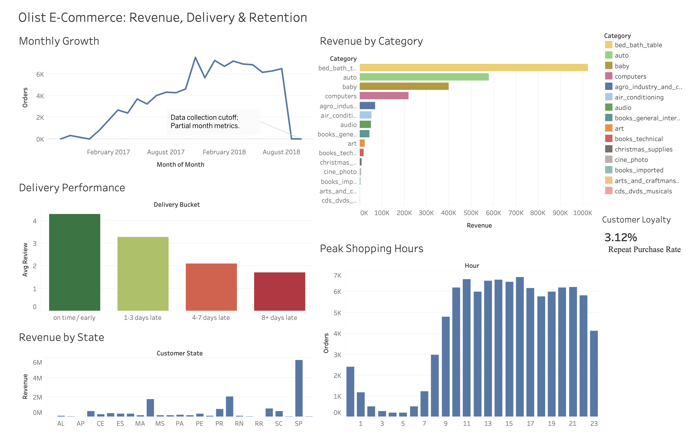

# Olist E-Commerce: Sales, Delivery, and Retention Analytics

End-to-end analytics project on 100K Brazilian e-commerce orders. Built to answer five business questions about revenue concentration, delivery quality, and customer retention.

## Dashboard



Tableau workbook available in `Tableau_Workbook/`. Open with [Tableau Public Desktop](https://public.tableau.com/en-us/s/download) (free) or Tableau Reader. Presentation materials are in `All Sheets - ppt & pdf/`.

## Stack
PostgreSQL · Python (pandas) · Tableau Public

## Dataset
**Source:** [Olist Brazilian E-Commerce, public Kaggle dataset](https://www.kaggle.com/datasets/olistbr/brazilian-ecommerce)

~100K orders across 9 related tables, covering September 2016 to October 2018. Raw CSVs are not committed (Kaggle terms, keeps the repo lightweight). Download directly from the link above.

## Business questions
1. Where does revenue come from geographically?
2. Which product categories drive revenue concentration?
3. Does delivery delay predict bad reviews?
4. What is the repeat purchase rate?
5. When do customers order (peak patterns)?

## Approach
1. Modeled 7 related tables in PostgreSQL with primary and foreign keys.
2. Built a reusable view to pre-aggregate items at order grain, preventing double-counted revenue across one-to-many joins.
3. Wrote 9 business SQL queries using CTEs, window functions, conditional aggregation (`FILTER`), and cohort logic.
4. Exported results to CSV and built a 5-chart Tableau dashboard.

## Key findings
1. **Revenue is geographically concentrated.** São Paulo state alone drives roughly 45% of revenue, with the top 5 states carrying about 75%. Total revenue across the period: R$13.2M.
2. **Late delivery is the dominant satisfaction killer.** On-time orders average 4.3 stars. Orders arriving 8+ days late average 1.7 stars. A clear gradient runs across all four delay buckets.
3. **Repeat purchase rate is only 3.12%.** Olist is acquisition-driven, not retention-driven. Cohort analysis confirms near-zero return rate beyond month 0.

## Recommendations
1. **Concentrate spend in the top revenue corridor.** Focus logistics and marketing investment in São Paulo and adjacent states for marginal-cost wins.
2. **Fix the delivery promise, not just delivery speed.** Either tighten delivery SLAs or pad customer-facing delivery estimates. Missing the promise damages reviews more than slower-but-honest estimates would.
3. **Build a basic retention motion.** Post-purchase email sequence, reorder reminder at category-typical repurchase interval. Low current repeat rate means even small lifts move the needle.

## Caveats
- No cost data in the dataset, so no true margin analysis. Used revenue concentration instead.
- Delivery-review relationship is association, not causation. A controlled test would be needed to confirm causality.
- Boundary months (September 2016, October 2018) are partial due to the data export cutoff.
- Cohort retention is sparse by design, consistent with the 3.12% overall repeat rate.

## How to reproduce

**Prerequisites:** PostgreSQL 14 or later, `psql` CLI.

1. **Download the dataset** from [Kaggle](https://www.kaggle.com/datasets/olistbr/brazilian-ecommerce) and unzip into a local folder.
2. **Create the database** in psql:
```sql
   CREATE DATABASE olist;
   \c olist
```
3. **Run setup:** open `SQL/00_setup.sql`, uncomment the `\copy` lines, replace `PATH` with your local unzip path, then execute the file:
```bash
   psql -d olist -f SQL/00_setup.sql
```
4. **Create the foundation view:**
```bash
   psql -d olist -f SQL/00_view_order_revenue.sql
```
5. **Run any business query:**
```bash
   psql -d olist -f SQL/03_delay_buckets_vs_reviews.sql
```
6. **(Optional)** Run `python/export_csvs.py` to export query results to CSV for dashboard consumption.

## Repository structure
```
.
├── SQL/                          # 11 SQL files: setup, foundation view, 9 business queries
├── Tableau_Workbook/             # .twbx workbook file
├── dashboard/                    # Dashboard screenshot
├── python/                       # CSV export script
├── All Sheets - ppt & pdf/       # Project presentation deck and PDF
├── .gitignore
└── README.md
```

## SQL query index

| File | Question | Concepts |
|---|---|---|
| `00_setup.sql` | Schema + load + FKs | DDL, `\copy`, foreign keys |
| `00_view_order_revenue.sql` | Pre-aggregate items | View, `GROUP BY` |
| `01_revenue_by_state.sql` | Revenue + AOV by state | Multi-join, `DISTINCT` count |
| `02_category_pareto.sql` | Category 80/20 | CTE, window functions, `COALESCE` |
| `03_delay_buckets_vs_reviews.sql` | Delivery delay vs reviews | CTE, `CASE`, date math |
| `04_late_vs_ontime_headline.sql` | Headline late vs on-time | Binary `CASE`, conditional avg |
| `05_repeat_rate.sql` | Overall repeat rate | `FILTER`, `customer_unique_id` |
| `06_repeat_by_state.sql` | Repeat rate by state | `HAVING`, noise control |
| `07_cohort_retention.sql` | Monthly cohort | Multi-CTE, `DATE_TRUNC`, offset math |
| `08_orders_over_time.sql` | Monthly trend | `DATE_TRUNC` |
| `09_peak_patterns.sql` | Weekday + hour patterns | `EXTRACT`, `TO_CHAR` |

## Author
**Adi Karthikeya S B** · MS Data Science, University of Houston  
[LinkedIn](https://linkedin.com/in/adikarthikeya) · [Portfolio](https://adikarthikeya2003.github.io) · [GitHub](https://github.com/adikarthikeya2003)
